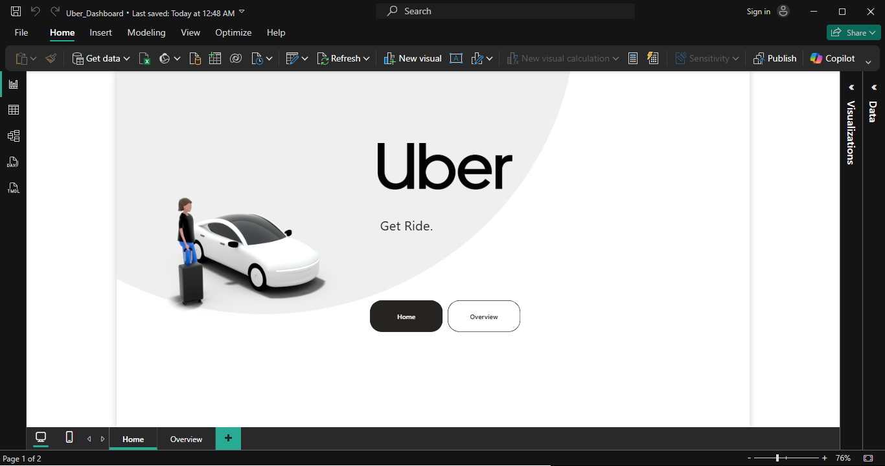
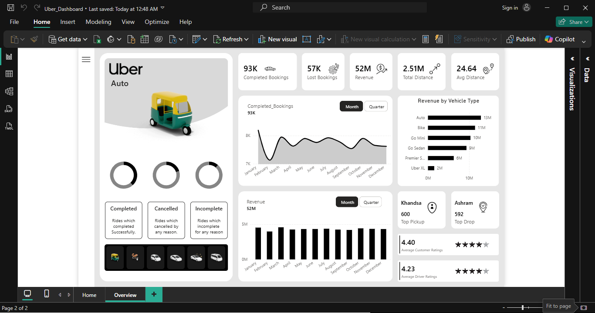

# Uber Operations Dashboard 🚖

An interactive Power BI dashboard built to analyze Uber ride bookings, revenue performance, cancellations, customer satisfaction, and vehicle-wise trends using 150,000+ booking records.

## Dashboard Preview

### Home Page



### Overview Dashboard



## Key Metrics

* 93K Completed Bookings
* 57K Lost Bookings
* 52M Revenue
* 2.51M Total Distance
* 4.40 Customer Rating
* 4.23 Driver Rating

## Features

* KPI Monitoring
* Revenue Analysis
* Booking Trend Analysis
* Vehicle-wise Performance
* Pickup & Drop Insights
* Customer & Driver Ratings
* Bookmark Navigation
* Custom Visual Design

## Tools Used

* Power BI
* DAX
* Power Query
* Excel

## Project Structure

```text id="zyx0so"
Uber-PowerBI-Dashboard/
├── Uber_Dashboard.pbix
├── README.md
├── assets/
└── dataset/
```

## Author

Portfolio project showcasing Power BI dashboard development, DAX, data modeling, and business intelligence reporting.
